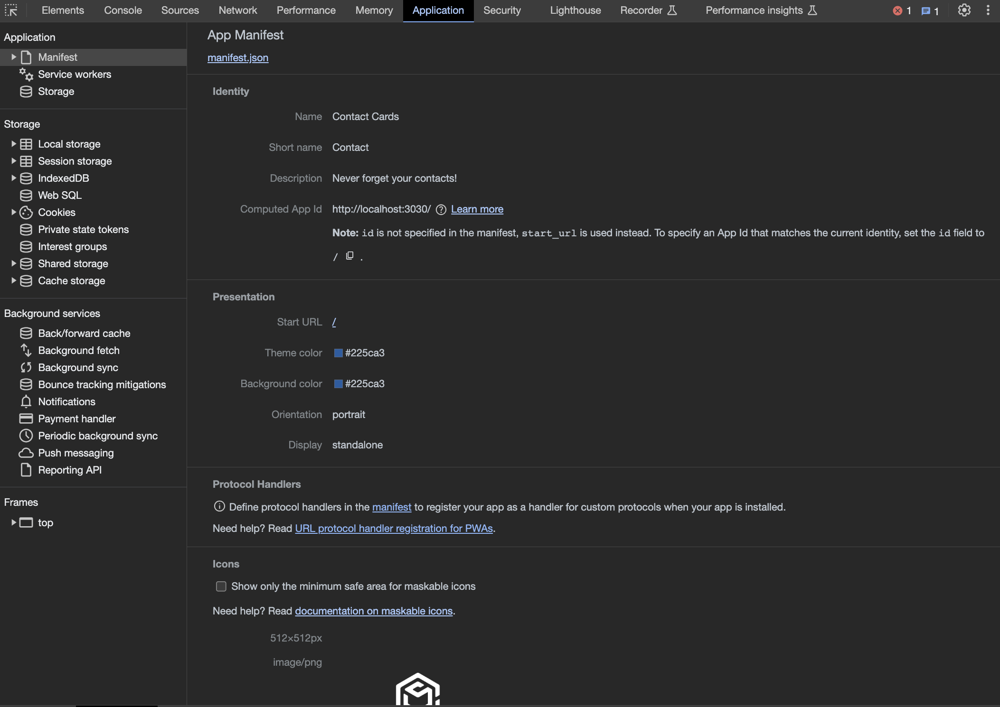

# 19-Text-Editor

## License
&nbsp;

* Select the badge to see details.
* To see more about license badges, visit [Shields IO](https://shields.io/category/license)

&nbsp;

## Description
You are out in the country somewhere...with NO internet connection. You are a devloper and would like the opportunity of being able to create notes or write important code snippets that come to mind...EVEN if internet is not available. This app enables you to do exatly that. You can then retrieve important inoformation or data you initialized when you are back at the office. This app is for you!

&nbsp;

## Table of Contents

 * [Installation](#installation)
 * [Usage](#usage)
 * [Media](#media)
 * [Testing](#testing)
 * [Contribution](#contribution)
 

&nbsp;

## Installation

There are several steps

* [Node.js Installation](https://nodejs.org/en)

* [NPM Installation](https://docs.npmjs.com/cli/v8/commands/npm-install)

&nbsp;

[Table of Contents](#table-of-contents)

## Usage

several steps

&nbsp;

[Table of Contents](#table-of-contents)

## Media
&nbsp;

## Manifest

&nbsp;

## Service Workers

&nbsp;

## Storage

&nbsp;

## Deployment

&nbsp;

* Visit [Heroku Deployment](https://stark-waters-79841-fed4a36c712d.herokuapp.com/)

&nbsp;

[Table of Contents](#table-of-contents)

## Testing

Postman or Insomnia

&nbsp;

[Table of Contents](#table-of-contents)

## Contribution

* [Original Source code](https://github.com/coding-boot-camp/potential-enigma)
* [Guideline to Professional README](https://coding-boot-camp.github.io/full-stack/github/professional-readme-guide)

&nbsp;

[Table of Contents](#table-of-contents)

## Questions

_If you have any questions, please feel free to contact me._

GitHub Username: [waynefenwick](https://github.com/waynefenwick)

Email Address: <a href="mailto:waynefenwick@gmail.com">waynefenwick@gmail.com</a>

&nbsp;

_Thanks for taking time to visit this repository!_

[Back to Top](#)

